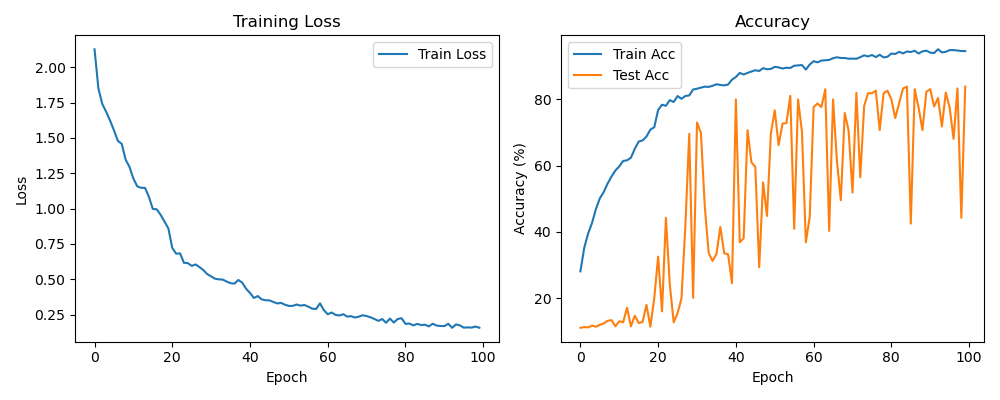

# Point Cloud Learning with PointNet

This project implements and trains a **PointNet** architecture in PyTorch for 3D shape classification using the **ModelNet10** dataset.  
It includes data preprocessing, a PointNet model with input and feature T-Nets, and a training pipeline with regularization.

---

## 🚀 Goal
To implement a PointNet model for point cloud classification and achieve robust performance on the ModelNet10 dataset.

---

## 🧠 Method
PointNet operates directly on point sets by:
- Applying an **Input T-Net** for point cloud alignment.
- Extracting point-wise features using shared MLP layers.
- Aggregating global features via max pooling.
- Applying a **Feature T-Net** for learned feature space alignment.
- Final classification using fully connected layers.

**Additional Improvements:**
- Feature transform regularization for better generalization.
- Learning rate scheduling (`StepLR`).
- Training for 100 epochs.

---

## 📈 Results
Achieved **Train Acc: 94.53%** and **Test Acc: 83.81%** after 100 epochs.

| Metric            | Value       |
|-------------------|------------|
| Final Train Acc    | 94.53%     |
| Final Test Acc     | 83.81%     |
| Final Train Loss   | 0.1579     |



---

## ⚙️ How to Run
1️⃣ Clone the repository:
```bash
git clone https://github.com/your-username/point-cloud-learning.git
cd point-cloud-learning
