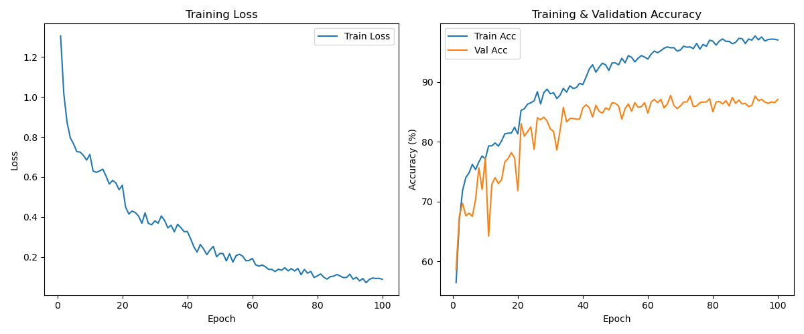
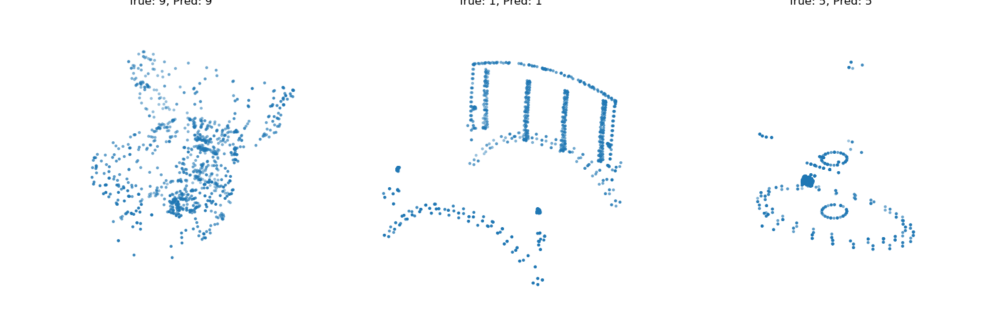

# Point Cloud Learning with PointNet++

This project implements and trains the **PointNet++** architecture in PyTorch for robust 3D point cloud classification using the **ModelNet10** dataset.

## 🚀 Goal

To implement PointNet++ for point cloud classification and assess its robustness when subjected to data augmentation and noise.

## 🧠 Method

PointNet++ uses hierarchical feature learning with Set Abstraction layers:

* **SA1**: Farthest Point Sampling and local point grouping for fine-scale feature extraction.
* **SA2**: Higher-level point feature abstraction.
* Global pooling for global feature generation.
* Fully connected classification layers.

Additional data augmentations:

* **Jitter:** Random Gaussian noise for point coordinates.
* **Dropout:** Random point dropping to simulate sparse or incomplete point clouds.

## 📈 Results

* **Baseline Model:** Achieved \~87% test accuracy.
* **With Noise Augmentations:** Achieved \~83% test accuracy, indicating some performance degradation due to noise.

### ⚡️ New Results After Improvements

Results will be added here after training concludes, providing a detailed comparison between the baseline, noise-augmented, and improved setups.

## 🖼️ Figures

* Training Curves:
  

* Evaluated Samples:
  

## ⚙️ How to Run

1️⃣ Clone the repository:

```bash
git clone https://github.com/your-username/point-cloud-learning.git
cd point-cloud-learning
```

2️⃣ Train the model:

```bash
python train_pp.py
```

3️⃣ Evaluate the trained model:

```bash
python evaluate.py --model path/to/model.pth --data path/to/data_dir
```

## 📚 Dependencies

* PyTorch 2.0
* NumPy 1.24
* Matplotlib

## 🏁 Summary

PointNet++ provides strong baseline performance (\~87%), and while data augmentation introduces noise leading to \~83% accuracy, it is an essential step towards making the model robust for real-world applications in robotics and autonomous navigation. Results after improvements will further highlight enhanced robustness and performance.
