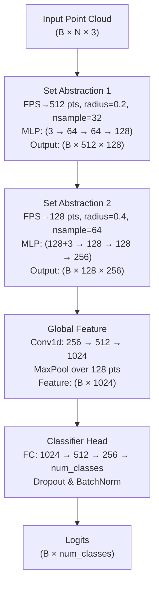

# PointNet++ Implementation

This repository contains a PyTorch implementation of the PointNet++ architecture for point cloud classification on ModelNet10.

---

## Architecture Overview



1. **Set Abstraction (SA) Module**

   * **Sampling**: Farthest Point Sampling chooses a subset of representative centroids.
   * **Grouping**: Ball Query collects up to `nsample` neighbors within `radius`.
   * **Feature Learning**: Shared MLP (1×1 conv) + BatchNorm + ReLU on local patches.
   * **Aggregation**: Max-pooling to produce one feature vector per centroid.

2. **Global Feature Extraction**

   * Two 1D-convolutions on the last SA feature map (256 × 128).
   * Followed by a global max-pool across all 128 points to yield a 1024-D embedding.

3. **Classifier Head**

   * Fully connected layers: 1024 → 512 → 256 → num\_classes.
   * Includes BatchNorm, ReLU, and 50% Dropout for regularization.

---

## File Structure

```
pointnet_plus_plus/
│
├─ model_pp.py          # Model definitions (SA layers, PointNet++ class)
├─ train_pp.py          # Training script with DataLoader, train loop
├─ modelnet10_dataset.py# Custom PyTorch dataset for ModelNet10
└─ README.md            # This documentation
```

---

## Implementation Challenges

1. **FPS & Ball Query Efficiency**

   * Python loops over points/batches are inherently slow.
   * **Solution**: Started with clear Python logic for correctness, then planned to port to C++/CUDA or use PyTorch ops (e.g., `torch.topk`) for speed.

2. **Batch Indexing Utilities**

   * Indexing with batch offsets can be error-prone.
   * **Solution**: Wrote and tested a generic `index_points` function; validated shapes at each stage.

3. **Handling Variable Neighborhood Sizes**

   * Some centroids may have fewer than `nsample` neighbors.
   * **Solution**: Padded with random repeats of existing neighbors to maintain a fixed-size tensor.

4. **Global Feature Aggregation**

   * Initial attempt tried to call SA with `npoint=None` which led to unexpected-arg errors.
   * **Solution**: Separated a dedicated `global_mlp` + global max-pool rather than overloading SA.

5. **Memory Constraints**

   * Operating on large point clouds can blow up GPU memory when grouping.
   * **Solution**: Kept batch sizes modest (16) and point counts (1024).  Further optimization pending.

---

Thank you for exploring this implementation! Feel free to raise issues or contribute improvements.
